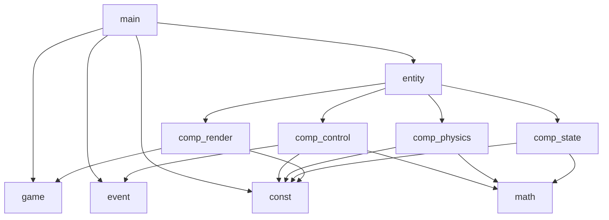
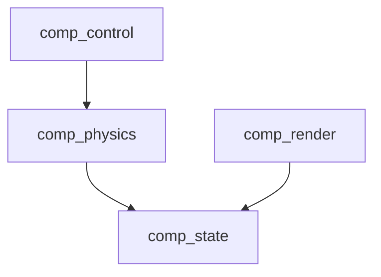

# physics-sync-demo

## 简介
最小物理同步demo，参考自GDC2017看门狗2分享

## 计划
客户端:pygame * 2 - 服务器:python/go？
1. 单机：PlayerEntity:圆，摩擦力，质量，wasd四个方向力
2. 服务器实现，实现一个非预测状态同步模型
3. 实现预测-回滚状态同步模型
4. 2P接入，外插值预测，内插值平滑
5. 物理同步

## 依赖关系

### 模块依赖

### 组件依赖

