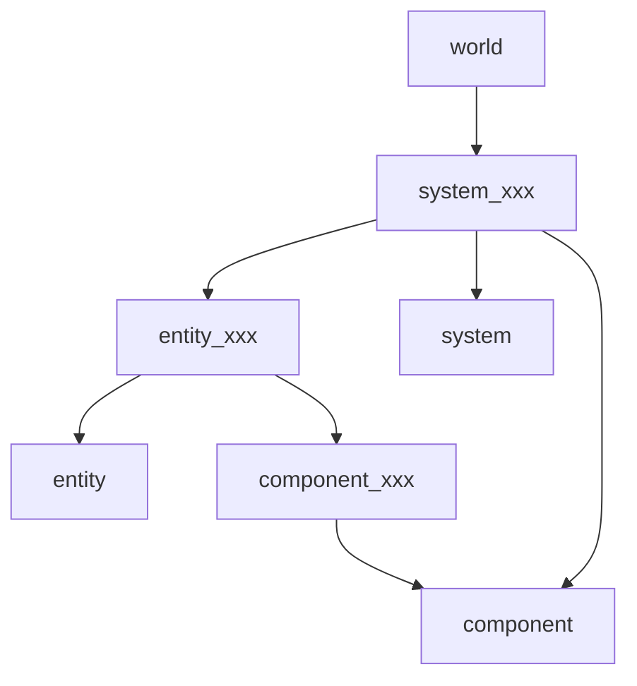
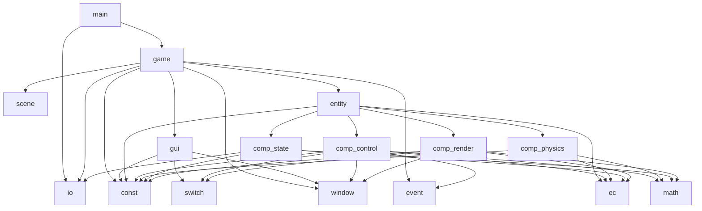
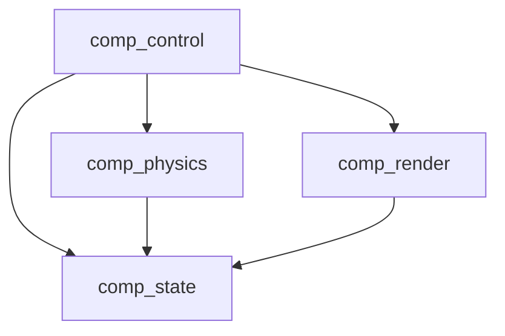
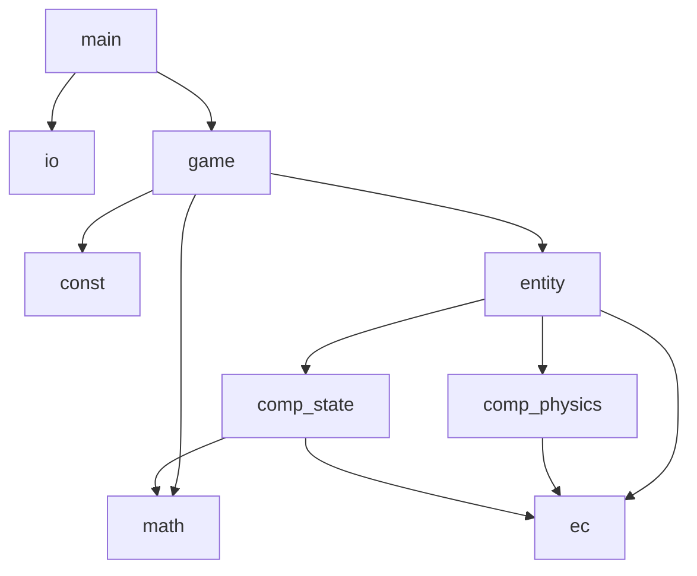
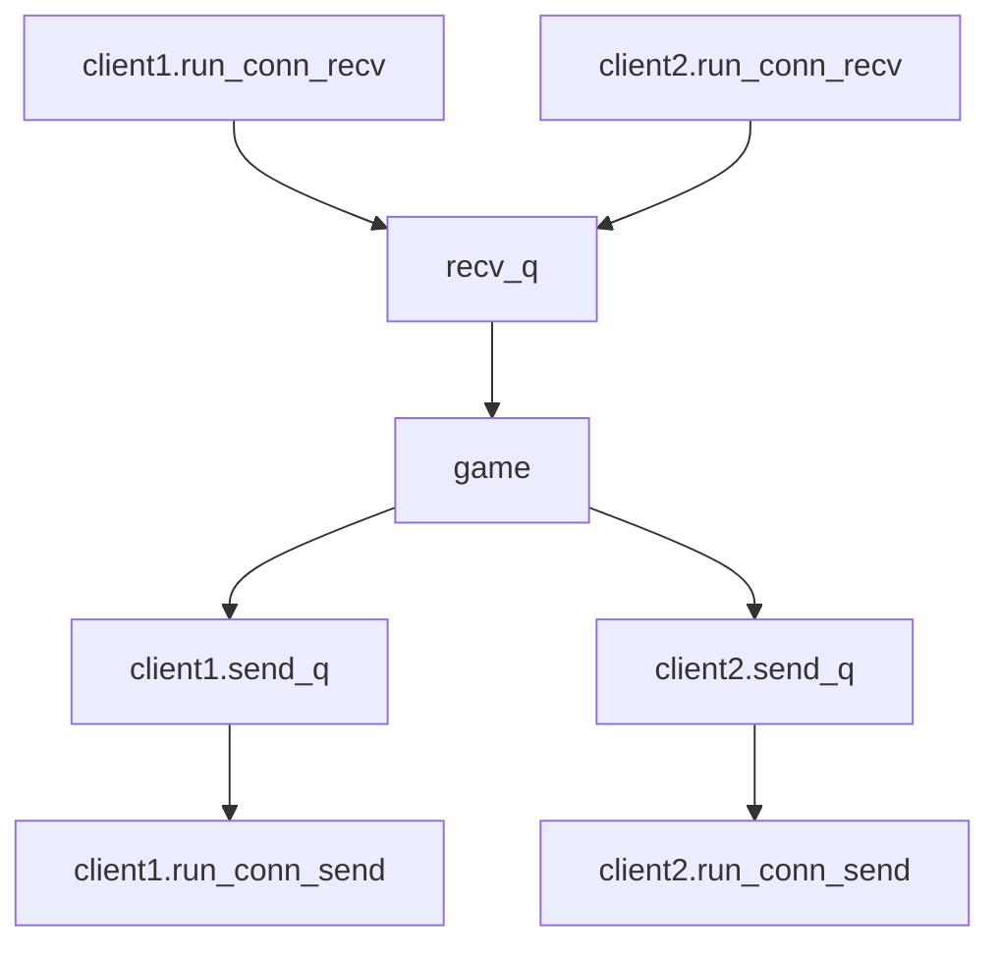

# physics-sync-demo

## 简介
最小物理同步demo，参考自GDC2018火箭联盟分享

## 目标特性
- 状态同步（客户端上传操作，服务器物理模拟）
- 服务器缓冲（延迟会导致帧序与客户端不一致）
- 主控预测（预测失败回滚世界重放）
- 副本内插值+缓冲
- 副本外插值预测：Predict Everything
- 物理模拟混合

## 很重要但不做的
- 状态指令冲突

## 计划
客户端:pygame * n - 服务器:python
1. 单机：球，摩擦力，质量，力，wasd控制 【完成】
2. 多样化控制，GUI 【完成】
3. 客户端操作上传服务器，物理模拟移交服务器，服务器下发状态 【完成】
4. 客户端物理预测，预测失败回滚重放
5. 客机接入，内插值
6. 完善服务器物理模拟（单机验证）
7. 输入缓冲，消息剔除
8. 外插值+物理混合

## 帧率 & 采样率
- 客户端-服务器：相同逻辑帧：更新世界物理状态
- 客户端：渲染帧：插值渲染
- 采样率：客户端逻辑帧采样操作，上传；服务器低频采样状态，下发
- 渲染60：客户端渲染
- 逻辑30：客户端input、采样输入、output、逻辑，服务器input、逻辑
- 状态20：服务器采样状态、output

## 确定性
- c/s保证逻辑帧率一致
- s维护的c中记录帧号，c的帧号和s保持一致，做到任意时刻c/s处于同一帧号
- c的x帧延迟时，s将会用x-1帧输入作为x帧输入并计算，这导致s的x帧状态与c预测的x帧状态不一致，c回滚重放

## ECS
### client
- world
      - control
        force_normal
        line_...
      - physics
  - record
    records
  - render
    client_entity_sur
    client_interpolation_...
    server_entity_sur
    other_render_func
      - state
        client_pos
        client_v
      - event
        key_state
        mouse_state
  - gui
    ...
  
self.add_system(system_package_dispatch.SystemPackageDispatch()) 分发网络包
self.add_system(system_entity_manager.SystemEntityManager())     遍历全局网络包，创建、销毁实体
self.add_system(system_recv_state.SystemRecvState())             遍历实体网络包，更新服务端状态-坐标
self.add_system(system_game_event.SystemGameEvent())             处理事件，input、gui
self.add_system(system_control.SystemControl())                  根据input，更新控制指令
self.add_system(system_sync_cmd.SystemSyncCmd())                 帧号增加，控制指令发送服务器
self.add_system(system_physics.SystemPhysics())                  执行控制指令，更新客户端状态
self.add_system(system_render_logic.SystemRenderLogic())         更新客户端状态的渲染插值
self.add_system(system_rollback.SystemRollback())                记录帧，比对实体网络状态、回滚

### server
- world
  - entity_game 实体_游戏 (component_package)
  - entity_player 实体_玩家 (component_connection, component_package, component_physics, component_frame, component_transform)
  - component_connection 组件_连接 (send_q)
  - component_package 组件_消息包 (packages)
  - component_physics 组件_操控 (force_normal)
  - component_frame 组件_帧 (frame)
  - component_transform 组件_移动 (position, velocity)
  - system_package_dispatch 系统_消息包分发 (component_package)
  - system_entity_manager 系统_实体管理 (component_connection)
  - system_sync_cmd 系统_操控 (component_package, component_physics, component_frame)
  - system_physics 系统_物理 (component_physics, component_transform)
  - system_sync_state 系统_状态同步 (component_connection, component_physics, component_transform, component_frame)

## 依赖关系
### ECS
#### 服务端



### 客户端
#### 模块依赖

#### 组件依赖

### 服务端
#### 模块依赖

#### 线程模型


## 通信消息
### client
#### sync
```json
{
  "p": {
    "x": 1.0,
    "y": 1.0
  },
  "v": {
    "x": 1.0,
    "y": 1.0
  }
}
```
### server
#### sync
```json
{
  "p": {
    "x": 1.0,
    "y": 1.0
  },
  "v": {
    "x": 1.0,
    "y": 1.0
  }
}
```
