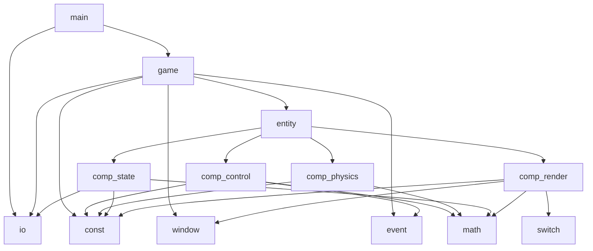
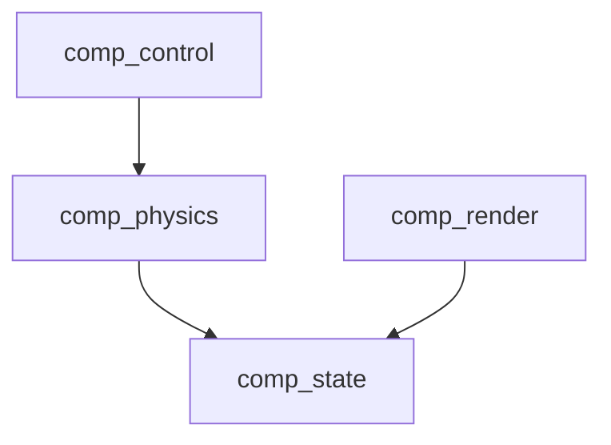
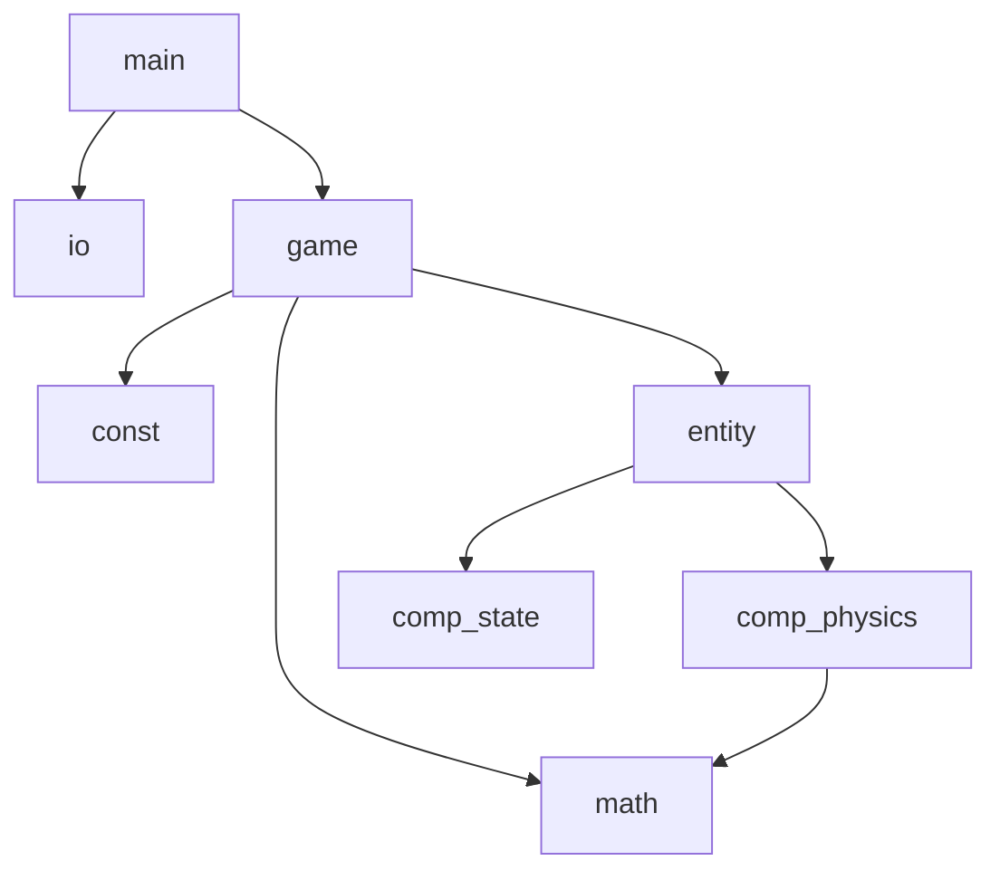

# physics-sync-demo

## 简介
最小物理同步demo，参考自GDC2017看门狗2分享

## 计划
客户端:pygame * 2 - 服务器:python/go？
1. 单机：PlayerEntity:圆，摩擦力，质量，wasd四个方向力 【完成】
2. 服务器实现，实现一个非预测状态同步模型 【完成】
3. 多样化控制，GUI
4. 回滚状态
5. 2P接入，外插值预测，内插值平滑
6. 物理同步

## 依赖关系

### 客户端

#### 模块依赖

#### 组件依赖

### 服务端

#### 模块依赖

