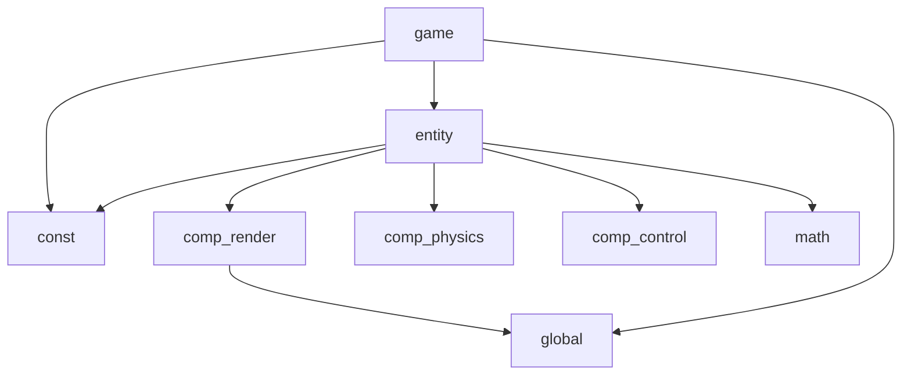

## physics-sync-demo
Physics Simulation Blending demo - c/s物理同步demo

## 计划：
client:pygame * 2 - server:go
1. 单机：PlayerEntity:圆，摩擦力，质量，wasd四个方向力
2. 服务器实现，实现一个非预测状态同步模型
3. 实现预测-回滚状态同步模型
4. 2P接入，外插值预测，内插值平滑
5. 物理同步

## 模块引用关系

