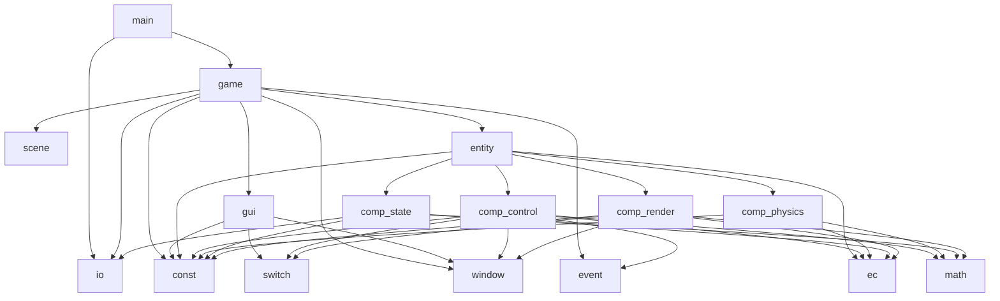
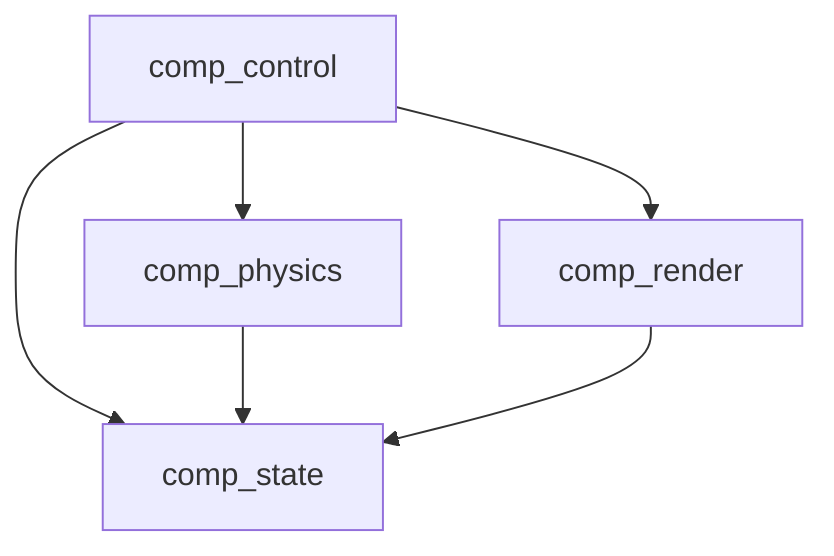
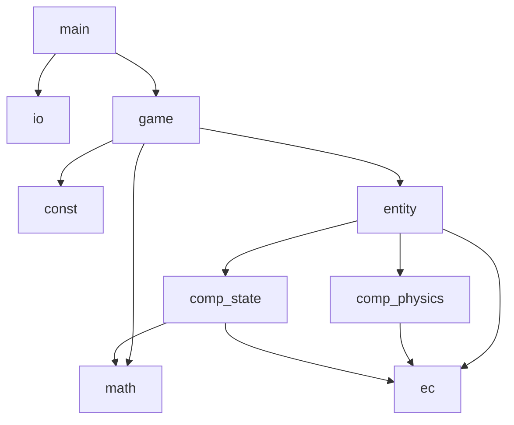
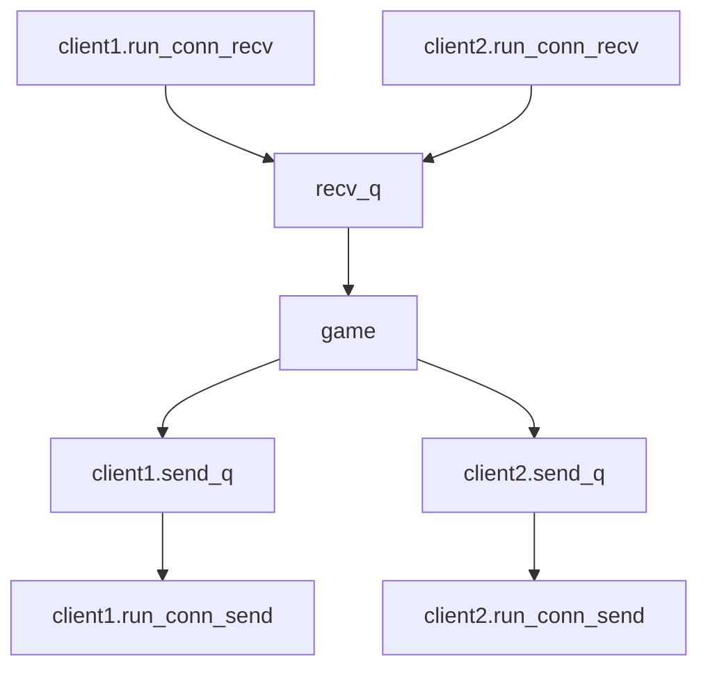

# physics-sync-demo

## 简介
最小物理同步demo，参考自GDC2017看门狗2分享

## 目标特性
- 状态同步（服务端碰撞）
- 主控预测
- 副本内插值平滑
- 副本状态缓冲
- 副本外插值预测
- 物理模拟混合

## 很重要但不做的
- 状态指令冲突

## 计划
客户端:pygame * n - 服务器:python
1. 单机：球，摩擦力，质量，力，wasd控制 【完成】
2. 多样化控制，GUI 【完成】
3. 客户端操作上传服务器，物理模拟移交服务器，服务器下发状态
4. 客户端物理预测，预测失败回滚
5. 3P接入，内插值
6. 完善服务器物理模拟（单机验证）
7. 输入缓冲
8. 外插值+物理混合

## 依赖关系
### 客户端
#### 模块依赖

#### 组件依赖

### 服务端
#### 模块依赖

#### 线程模型


## 通信消息
### client
#### sync
```json
{
  "p": {
    "x": 1.0,
    "y": 1.0
  },
  "v": {
    "x": 1.0,
    "y": 1.0
  }
}
```
### server
#### sync
```json
{
  "p": {
    "x": 1.0,
    "y": 1.0
  },
  "v": {
    "x": 1.0,
    "y": 1.0
  }
}
```
