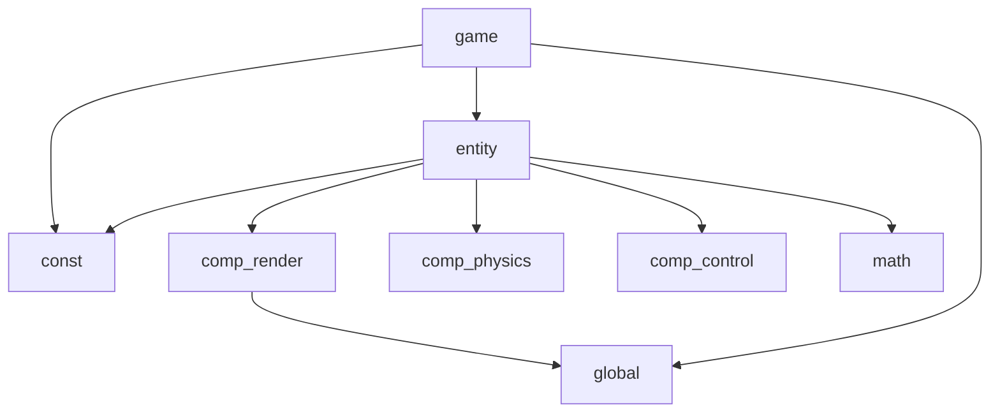

## 模块引用关系

```mermaid
graph TD
     game --> const
     game --> entity
     game --> global

     entity --> const
     entity --> comp_render
     entity --> comp_physics
     entity --> comp_control
     entity --> math

     comp_render --> global
```
